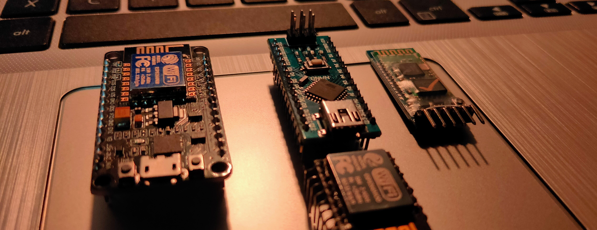

<!-- ### Hi there 👋 Welcome to my GitHub Account! I'm Souvik Das, full stack developer.... -->

<h3 style="border-left: 3px solid gray; padding-left: 10px;"> Hi there 👋 Welcome to my GitHub Account! I'm Souvik Das, full stack developer.... </h3>

<!-- **SouvikDas-git/SouvikDas-git** is a ✨ _special_ ✨ repository because its `README.md` (this file) appears on your GitHub profile.

Here are some ideas to get you started: -->
<br>



<br>
<br>

- 🔭 I’m currently working on ...
- 🌱 I’m currently learning ...
- 👯 I’m looking to collaborate on ...
- 🤔 I’m looking for help with ...
- 💬 Ask me about ...
- 📫 How to reach me: ...
- 😄 Pronouns: ...
- ⚡ Fun fact: ...

<br>

<!-- ### aboutMe.js -->
<h3 style="border-left: 3px solid gray; padding-left: 10px;"> AboutMe.js </h3>
<br>

```javascript
const Souvik = {
    pronouns: "he" | "him",
    code: [Javascript, HTML, CSS, C, C++, C#, python],
    askMeAbout: ["web dev", "tech", "Programming", "music", "coffee"],
    technologies: {
        frontEnd: {
            css: ["bootstrap", "SASS"]
        },
        backEnd: {
            js: ["vue", "node"]
        }
    }
};
```

<!--  -->


<!-- ## Heyyo, I'm <a href="https://github.com/SouvikDas-git" target="_blank">Aakarsh</a>!
(Use dark theme to find my socials ;) -->

<!-- <a href="https://aakarsh.me" target="_blank"></a>
<a href="https://linkedin.com/in/aakarshb" target="_blank">
<a href="https://behance.net/aakarshb" target="_blank">
<a href="https://dribbble.com/aakarshb" target="_blank">
<a href="https://instagram.com/_.aakarsh._" target="_blank">
<a href="https://twitter.com/Aakarsh-Bhttps://www.w3.org/html/" target="_blank">
<a href="https://medium.com/@aakarshbiju" target="_blank">
<a href="https://dev.to/aakarshb" target="_blank"></a>

<br />
<br />
<br /> -->

<br>

<!-- ### Languages : -->
<h3 style="border-left: 3px solid gray; padding-left: 10px;"> Languages : </h3>

<a href="https://www.w3.org/html/" target="_blank" style="margin: 5px">

</a>

<a href="https://www.w3schools.com/css/" target="_blank" style="margin: 5px">

</a>

<a href="https://www.javascript.com/" target="_blank" style="margin: 5px">

</a>

<a href="https://www.python.org/" target="_blank">

</a>

<a href="https://www.cprogramming.com/" target="_blank" style="margin: 5px">

</a>

<a href="https://www.cprogramming.com/" target="_blank" style="margin: 5px">

</a>

<a href="https://www.php.net/" target="_blank" style="margin: 5px">

</a>

<a href="https://www.mysql.com/" target="_blank" style="margin: 5px">

</a>

<a href="https://www.ruby-lang.org/en/" target="_blank" style="margin: 5px">

</a>

<a href="https://developer.apple.com/swift/" target="_blank" style="margin: 5px">

</a>

<br>

<!-- ### Libraries and frameworks : -->
<h3 style="border-left: 3px solid gray; padding-left: 10px;"> Libraries and frameworks : </h3>

<a href="https://jquery.com/" target="_blank" style="margin: 5px">

</a>

<a href="https://getbootstrap.com/" target="_blank" style="margin: 5px">

</a>

<br>

<!-- ### Softwares and Tools : -->
<h3 style="border-left: 3px solid gray; padding-left: 10px;"> Softwares and Tools : </h3>

<!--  -->

<a href="https://code.visualstudio.com/" target="_blank" style="margin: 5px">

</a>

<a href="https://www.google.com/chrome/fast-and-secure/" target="_blank" style="margin: 5px">

</a>

<br>
<br>

<!-- ### Now Playing 🎧 -->

<!-- [](https://open.spotify.com/user/mr5jgbqp3jw221j271iz2nix9) -->
<!-- <br/> -->

---

<br>

[](https://github.com/anuraghazra/github-readme-stats)

[](https://github.com/anuraghazra/github-readme-stats)
